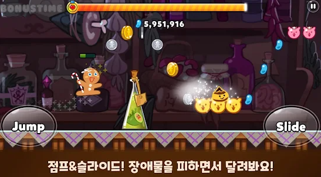
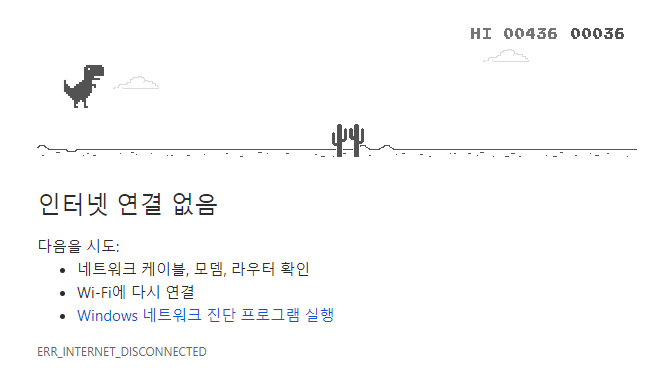
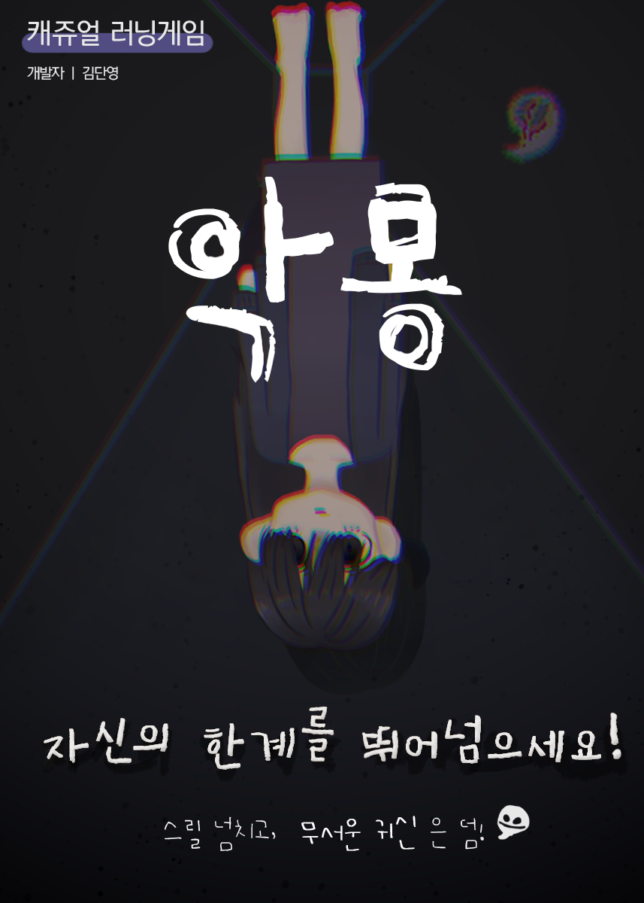

# 프로젝트명: 악몽
- 악몽을 꾸고 있는 소녀가 꿈 속에서 유령(장애물)을 피하는 전체연령가 러닝게임!

# [ 목차 ]
### 1. [컨셉](#컨셉)
### 2. [관련 이미지](#관련-이미지)
### 3. [대표 이미지](#대표-이미지)
### 4. [컨셉과 대표이미지 기반 작품 묘사](#컨셉과-대표이미지-기반-작품묘사)
### 5. [게임 구성 요소](#게임-구성-요소)
### 6. [게임 규칙](#게임-규칙)

# [컨셉]

## 메인컨셉 : 러닝

- 플레이어가 계속해서 달리며 점프를 통해 장애물을 피하는 게임.

### 서브 컨셉 1 : 스토리

- 매일 악몽을 꾸는 어린 소녀가 악몽에서 깨어나고 싶어 탈출구를 찾아 뛰기 시작하지만 탈출은 할 수없고, 같은 공간을 계속해서 뛰는 스토리 적인 부분을 지니고 있음.
- 주인공 : 악몽을 꾸는 소녀 (7살)
- 배경 : 플레이어 화면은 소녀의 꿈, 악몽이다.
- 장애물 : 악몽 속의 유령

### 서브 컨셉 2 : 디자인

- 스토리에 맞게 캐릭터 디자인과 장애물 디자인을 하였다.
- 어른 아이들도 플레이할 수 있게, 캐릭터와 장애물은 호감형이 갈 수 있게 끔하였다.

### 서브 컨셉 3 : 컨트롤

- 플레이어의 컨트롤에 따라 최고 기록을 세우며, 자신의 한계를 뛰어 넘고 싶어하는 도전욕구를 통해 재미를 느낄 수 있다.
- 플레이 스코어에 따라 게임 스피드는 증가되어 게임 난이도가 올라간다.

### 서브 컨셉 4 : 쉬운조작법

- 단순한 플레이를 기반으로 하고 있어, 플레이어들이 처음 게임을 접할 때 적응기간이 없을 뿐더러, 진입장벽이 낮다.

### 서브 컨셉 5 : 배경음악
 
- 악몽이라는 컨셉에 맞게 긴장감 넘치는 배경음악을 삽입하였다. 
  

# [관련 이미지]

- 관련 이미지  
  
  
  

# [대표 이미지]

# [컨셉과 대표이미지 기반 작품묘사]

> ### 대표이미지 기반 : 플레이어가 점프를 하여 장애물을 피해 최고기록을 달성한다. 장애물에 닿았을 때 게임이 오버되며 스코어가 최고기록을 달성하면 최고기록을 저장한다.
> ### 컨셉 기반: 악몽이라는 배경에서 유령에 닿지 않고 계속해서 피하면 게임은 종료되지 않는다.

  

# [게임 구성 요소]

## 1. 메커니즘

[도전 과제]

1. 장애물에 닿지 않게 해라.
2. 최고기록을 달성해라.

[재미 요소]

1. 스코어에 따라 게임 스피드가 빨라져 게임에 더욱 집중 할 수 있다.
2. 스코어를 높여 최고기록을 달성하여 게임의 몰입도가 높아질 것이다.
3. 스토리 적인 부분과 디자인 부분에서 게임의 흥미를 높일 수 있다.
4. 앞에서 다가오는 장애물을 피하는 단순한 게임이므로 진입장벽이 낮아서 튜토리얼없이 빠르게 게임에 진입가능하다. 

[기술]
1. Unity 

## 2. 이야기

[게임 스토리]
매일 악몽을 꾸는 어린 소녀가 악몽에서 깨어나고 싶어 탈출구를 찾아 뛰기 시작하지만 탈출은 할 수 없었다. 같은 공간을 계속해서 뛸 뿐이였다.

[만들게 된 배경]  
모든 연령층이 할 수 있는 게임을 만들고 싶어 조작이 쉽고, 게임 난이도가 낮은 간단한 게임을 제작하게 되었습니다.

# [게임 규칙]
- 장애물에 닿았을 때 게임오버.

